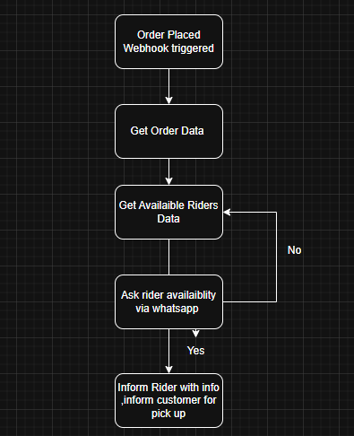

 

Here’s a **formal GitHub front page description** for your project:

---

# 🚀 Automated Delivery Order Handling Agent

This project implements an **AI-powered workflow agent** for automating the process of assigning delivery riders to customer orders. It integrates **LangChain, MCP (Model Context Protocol), Google Generative AI, and FastAPI** to handle the full lifecycle of an order, from placement to rider assignment and customer notification.

## 🔹 Features

* **Order Data Retrieval**: Fetches order details from the database via MCP tools.
* **Rider Selection**: Automatically selects available riders, avoiding previously rejected ones.
* **Rider Availability Check**: Sends WhatsApp messages to confirm rider availability.
* **Decision Handling**:

  * ✅ If rider accepts → Inform customer.
  * ❌ If rider declines → Select another rider.
  * ⏳ If no response → Retry with another rider.
* **Customer Notification**: Notifies the customer once a rider is successfully assigned.
* **Database Updates**: Updates order and rider status in the backend database.
* **Async Workflow Execution**: Built with `asyncio` for efficient parallel operations.

## 🔹 Tech Stack

* **LangChain** – For agent workflows & structured responses
* **Google Generative AI (Gemini 2.5)** – For intelligent decision-making
* **MCP (Model Context Protocol)** – To interact with external services (DB & WhatsApp)
* **FastAPI** – API integration and webhooks
* **Prisma** – Database ORM
* **Requests** – For HTTP calls

## 🔹 Workflow Overview

1. **Order placed** → Fetch order details.
2. **Get rider data** → Select random available rider.
3. **Ask rider availability** → Send WhatsApp confirmation.
4. **Process reply** → Yes / No / No Reply.
5. **Loop if declined or no reply**.
6. **Inform customer** once a rider is confirmed.

## 🔹 Future Improvements

* Add retry mechanism with exponential backoff for rider responses.
* Integrate with multiple communication channels (SMS, Email).
* Enhance rider selection logic with ranking (distance, success rate).
* Real-time dashboard for monitoring order lifecycle.

---

Do you want me to make this **more startup-pitch style** (salesy for clients) or keep it **developer-focused** (technical, for contributors)?

 
